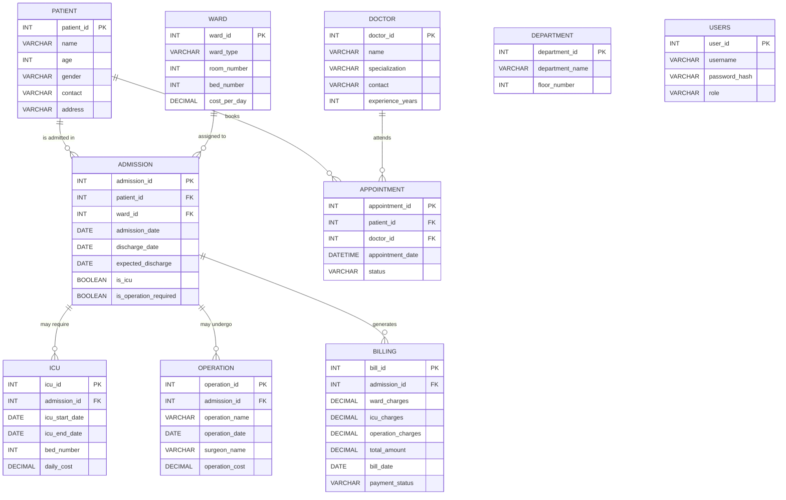

# 🏥 Hospital Management — ER Diagram

## Entity-Relationship Diagram

---

## Relationships Summary

| Relationship | Type | Description |
|---|---|---|
| `PATIENT → ADMISSION` | **1 : N** | A patient can have many admissions; each admission belongs to one patient |
| `WARD → ADMISSION` | **1 : N** | A ward can host many admissions; each admission is assigned one ward |
| `PATIENT → APPOINTMENT` | **1 : N** | A patient can book many appointments |
| `DOCTOR → APPOINTMENT` | **1 : N** | A doctor can attend many appointments |
| `ADMISSION → ICU` | **1 : N** | An admission can have multiple ICU stays |
| `ADMISSION → OPERATION` | **1 : N** | An admission can involve multiple operations |
| `ADMISSION → BILLING` | **1 : N** | An admission can generate multiple bills |

---

## Entity Details

### 🧑‍🤝‍🧑 PATIENT
| Column | Type | Constraints |
|---|---|---|
| `patient_id` | INT | PK, AUTO_INCREMENT |
| `name` | VARCHAR(50) | NOT NULL |
| `age` | INT | — |
| `gender` | VARCHAR(10) | — |
| `contact` | VARCHAR(15) | — |
| `address` | VARCHAR(100) | — |

### 🩺 DOCTOR
| Column | Type | Constraints |
|---|---|---|
| `doctor_id` | INT | PK, AUTO_INCREMENT |
| `name` | VARCHAR(50) | NOT NULL |
| `specialization` | VARCHAR(50) | — |
| `contact` | VARCHAR(15) | — |
| `experience_years` | INT | — |

### 🛏️ WARD
| Column | Type | Constraints |
|---|---|---|
| `ward_id` | INT | PK, AUTO_INCREMENT |
| `ward_type` | VARCHAR(30) | — |
| `room_number` | INT | — |
| `bed_number` | INT | — |
| `cost_per_day` | DECIMAL(10,2) | — |

### 🏢 DEPARTMENT
| Column | Type | Constraints |
|---|---|---|
| `department_id` | INT | PK, AUTO_INCREMENT |
| `department_name` | VARCHAR(50) | — |
| `floor_number` | INT | — |

### 📋 ADMISSION
| Column | Type | Constraints |
|---|---|---|
| `admission_id` | INT | PK, AUTO_INCREMENT |
| `patient_id` | INT | FK → `patient(patient_id)` ON DELETE CASCADE |
| `ward_id` | INT | FK → `ward(ward_id)` ON DELETE CASCADE |
| `admission_date` | DATE | — |
| `discharge_date` | DATE | — |
| `expected_discharge` | DATE | Added via ALTER |
| `is_icu` | BOOLEAN | DEFAULT FALSE |
| `is_operation_required` | BOOLEAN | DEFAULT FALSE |

### 📅 APPOINTMENT
| Column | Type | Constraints |
|---|---|---|
| `appointment_id` | INT | PK, AUTO_INCREMENT |
| `patient_id` | INT | FK → `patient(patient_id)` ON DELETE CASCADE |
| `doctor_id` | INT | FK → `doctor(doctor_id)` ON DELETE CASCADE |
| `appointment_date` | DATETIME | — |
| `status` | VARCHAR(20) | — |

### 🚨 ICU
| Column | Type | Constraints |
|---|---|---|
| `icu_id` | INT | PK, AUTO_INCREMENT |
| `admission_id` | INT | FK → `admission(admission_id)` |
| `icu_start_date` | DATE | — |
| `icu_end_date` | DATE | — |
| `bed_number` | INT | — |
| `daily_cost` | DECIMAL(10,2) | — |

### 🔪 OPERATION
| Column | Type | Constraints |
|---|---|---|
| `operation_id` | INT | PK, AUTO_INCREMENT |
| `admission_id` | INT | FK → `admission(admission_id)` ON DELETE CASCADE |
| `operation_name` | VARCHAR(100) | — |
| `operation_date` | DATE | — |
| `surgeon_name` | VARCHAR(100) | — |
| `operation_cost` | DECIMAL(10,2) | — |

### 💰 BILLING
| Column | Type | Constraints |
|---|---|---|
| `bill_id` | INT | PK, AUTO_INCREMENT |
| `admission_id` | INT | FK → `admission(admission_id)` ON DELETE CASCADE, NOT NULL |
| `ward_charges` | DECIMAL(10,2) | — |
| `icu_charges` | DECIMAL(10,2) | — |
| `operation_charges` | DECIMAL(10,2) | — |
| `total_amount` | DECIMAL(10,2) | — |
| `bill_date` | DATE | — |
| `payment_status` | VARCHAR(20) | — |

### 🔐 USERS
| Column | Type | Constraints |
|---|---|---|
| `user_id` | INT | PK, AUTO_INCREMENT |
| `username` | VARCHAR(50) | UNIQUE, NOT NULL |
| `password_hash` | VARCHAR(255) | NOT NULL |
| `role` | VARCHAR(30) | NOT NULL |

---

> [!NOTE]
> The **DEPARTMENT** table is defined in the schema but is not currently linked to any other table via foreign keys. It exists as a standalone entity.
> 
> The **USERS** table is used for application authentication and is not relationally linked to hospital entities.
>
> An earlier version of the **OPERATION** table in `tables.sql` referenced `patient_id`, `doctor_id`, and `operation_theatre(ot_id)`, but the active schema used by `app.py` links operations through `admission_id` instead.
